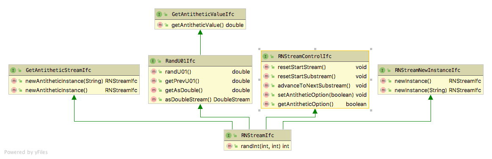

# Random Number Generation {#ch2-rng}

**[Learning Objectives]{.smallcaps}**

-   To be able to generate random numbers using the Java Simulation
    Library (JSL)
-	To understand how to control random number streams within the JSL

## Random Number Generator {#ch2-generator}

This section discusses how to random number generation is implemented
within the JSL. The purpose is to present how these concepts can be put into
practice. 

The random number generator used within the JSL is described in
@ecuyer2002an and has excellent statistical properties. It is based on the
combination of two multiple recursive generators resulting in a period
of approximately $3.1 \times 10^{57}$. This is the same generator that
is now used in many commercial simulation packages. The generator used in the JSL is 
defined by the following equations.

$$
\begin{aligned}
R_{1,i} & = (1,403,580 R_{1,i-2} - 810,728 R_{1,i-3})\bmod (2^{32}-209)\\
R_{2,i} & = (527,612R_{2,i-1} - 1,370,589 R_{2,i-3})\bmod (2^{32}-22,853)\\
Y_i & = (R_{1,i}-R_{2,i})\bmod(2^{32}-209)\\
U_i & = \frac{Y_i}{2^{32}-209}
\end{aligned}
$$

To illustrate how this generator works, consider generating an initial sequence of
pseudo-random numbers from the generator. The generator takes as its
initial seed a vector of six initial values
$(R_{1,0}, R_{1,1}, R_{1,2}, R_{2,0}, R_{2,1}, R_{2,2})$. The first
initially generated value, $U_{i}$, will start at index $3$. To produce five pseudo random numbers using this generator we need an initial seed vector, such as:
$$\lbrace R_{1,0}, R_{1,1}, R_{1,2}, R_{2,0}, R_{2,1}, R_{2,2} \rbrace = \lbrace 12345, 12345, 12345, 12345, 12345, 12345\rbrace$$

Using the recursive equations, the resulting random numbers are as follows:

                       i=3              i=4              i=5              i=6             i=7           
  -------------- ---------------- ---------------- ---------------- --------------- ---------------- -- --
    $Z_{1,i-3}=$      12345            12345            12345         3023790853       3023790853       
    $Z_{1,i-2}=$      12345            12345          3023790853      3023790853       3385359573       
    $Z_{1,i-1}=$      12345          3023790853       3023790853      3385359573       1322208174       
    $Z_{2,i-3}=$      12345            12345            12345         2478282264       1655725443       
    $Z_{2,i-2}=$      12345            12345          2478282264      1655725443       2057415812       
    $Z_{2,i-1}=$      12345          2478282264       1655725443      2057415812       2070190165       
      $Z_{1,i}=$    3023790853       3023790853       3385359573      1322208174       2930192941       
      $Z_{2,i}=$    2478282264       1655725443       2057415812      2070190165       1978299747       
          $Y_i=$    545508589        1368065410       1327943761      3546985096       951893194        
          $U_i=$  0.127011122076   0.318527565471   0.309186015655   0.82584686312   0.221629915834     

While it is beyond the scope of this document to explore the theoretical
underpinnings of this generator, it is important to note that the generator allows multiple independent streams to be defined along with sub-streams.

The fantastic thing about this generator is the sheer size of the
period. Based on their analysis, @ecuyer2002an state that it will be
"approximately 219 years into the future before average desktop
computers will have the capability to exhaust the cycle of the
(generator) in a year of continuous computing." In addition to the
period length, the generator has an enormous number of streams,
approximately $1.8 \times 10^{19}$ with stream lengths of
$1.7 \times 10^{38}$ and sub-streams of length $7.6 \times 10^{22}$
numbering at $2.3 \times 10^{15}$ per stream. Clearly, with these
properties, you do not have to worry about overlapping random numbers
when performing simulation experiments. The generator was subjected to a
rigorous battery of statistical tests and is known to have excellent
statistical properties.

## Random Package {#ch2-randompkg}

The concepts within L'Ecuyer et al. (2002) have been implemented within the [`jsl.utilities.random.rng`](https://rossetti.git-pages.uark.edu/JSL-Documentation/jsl/utilities/random/rng/package-summary.html) package in the JSL. A key organizing principle for the `random` package is the use of Java interfaces. A Java interface allows classes to act like other classes. It is a mechanism by which a class can promise to have
certain behaviors (i.e. methods). The JSL utilizes interfaces to
separate random number generation concepts from stream control concepts.

 

Figure \@ref(fig:RNStreamInterfaces) shows the important interfaces within the
`jsl.utilities.random.rng` package. The `RandU01Ifc` defines the methods for
getting the next pseudo-random number and the previous pseudo-random
number via `randU01()` and `getPrevU01()`. The `randInt(int i, int j)` method can be used to generate
a random integer uniformly over the range from $i$ to $j$. The methods `getAsDouble()` and 
`asDoubleStream()` permit the random number stream to act as a Java stream
as defined within the [Java Stream API](https://docs.oracle.com/javase/8/docs/api/?java/util/stream/Stream.html). 
The `GetAntitheticStreamIfc` and `RNStreamNewInstanceIfc` interfaces allow a new object
instance to be created from the stream.  In the case of the `GetAntitheticStreamIfc` interface
the created stream will produce antithetic variates from the stream. If $U$ is a pseudo-random number,
then $1-U$ is the antithetic variate of $U$.

The `RNStreamControlIfc` defines methods for controlling the underlying stream of pseudo-random numbers.

*   `resetStartStream()` - positions the random number generator at the
    beginning of its stream. This is the same location in the stream as
    assigned when the random number generator was created and
    initialized.
*   `resetStartSubstream()` - resets the position of the random number
    generator to the start of the current substream. If the random
    number generator has advanced into the substream, then this method
    resets to the beginning of the substream.
*   `advanceToNextSubStream()` - positions the random number generator at
    the beginning of its next substream. This method move through the
    current substream and positions the generator at the beginning of
    the next substream.
*   `setAntitheticOption(boolean flag)` - if the flag is true, the
    generator should start producing antithetic variates with the next
    call to `randU01()`. If the flag is false, the generator should stop
    producing antithetic variates. 
*   `getAntitheticOption()` - returns whether the antithetic option has
    been set.

The `RNStreamIfc` interface assumes that the underlying pseudo-random number generator can produce
multiple streams that can be further divided into substreams. The reset
methods allow the user to move within the streams. Classes that
implement the `RNStreamControlIfc` can manipulate the streams in a
well-defined manner. 

 

To create an concrete instance of a stream, we must have a random number stream provider. This
functionality is defined by the `RNStreamProviderIfc` interface and its concrete implementation, 
`RNStreamProvider`. Figure \@ref(fig:RNStreamProvider) illustrates the functionality available for
creating random number streams. This interface conceptualizes the creation of random number streams
as a process of making a sequence of streams numbered 1, 2, 3, ... 

A random number stream provider must define a default stream, which can be retrieved via the 
`defaultRNStream()` method. For the JSL, the default stream is the first
stream created and is label with the sequence number 1.  The sequence number of a stream
can be used to retrieve a particular stream from the provider.  The following methods
allow for creation and access to streams.

* `nextRNStream()` - returns the next random number stream associated with the provider. Each call
to `nextRNStream()` makes a new stream in the sequence of streams.
* `lastRNStreamNumber()` - returns the number of the stream that was last made. This indicates how
many streams have been made. If $0$ is returned, then no streams have been made by the provider.
* `rnStream(int k)` - returns the $k^{th}$ stream.  If $k$ is greater than `lastRNStreamNumber()` then `lastRNStreamNumber()` is advanced according to the additional number of streams by creating any intermediate streams. For example, if `lastRNStreamNumber()` = 10 and k = 15, then streams 11, 12, 13, 14, 15 are assumed provided and stream 15 is returned and `lastRNStreamNumber()` now equals 15.  If $k$ is less than or equal to `lastRNStreamNumber()`, then no new streams are created and  `lastRNStreamNumber()`stays at its current value and the $k^{th}$ stream is returned.
* `getStreamNumber(RNStreamIfc stream)` - returns the stream number of the instance of a stream.
* `advanceStreamMechanism(int n)` - advances the underlying stream mechanism by the specified number of streams, without actually creating the streams.  The value of `lastRNStreamNumber()` remains the same after advancing through 
the streams. In other words, this method should act as if `nextRNStream()` was not called but advance the underlying stream mechanism as if $n$ streams had been provided.
* `resetRNStreamSequence()` - Causes the random number stream provider to act as if has never created any streams. Thus,
the next call to `nextRNStream()` will return the $1^{st}$ stream.

The random number stream provider also facilitates the control of all streams that have been created. This functionality is similar to how the position within an individual stream can be manipulated, except the provider performs the functionality on all streams that it has created. The following methods perform this function.

* `resetAllStreamsToStart()` - resets all created streams to the start of their stream.
* `resetAllStreamsToStartOfCurrentSubStream()` - resets all created streams to the start of their current sub-stream.
* `advanceAllStreamsToNextSubstream()` - advances all created streams to the start of their next sub-stream.
* `setAllStreamsAntitheticOption(boolean option)` - changes all created streams to have their antithetic option either off = false or on = true.

Many random number generators require the specification of a seed to start the generated sequence.  Even though the generator within the JSL use seeds, there really is not any need to utilize the seeds because of the well defined methods for moving within the streams.  Now, let's illustrate how to create and manipulate streams.

### Creating and Using Streams {#ch2-creatingStreams}
To create a random number stream, the user must utilize an instance of `RNStreamProvider`.  This process is illustrated in in the following code.  This code creates two instances of `RNStreamProvider` and gets the first stream from each instance.  The instances of `RNStreamProvider` use the exact same underlying default seeds. Thus, they produce *exactly the same* sequence of streams.

(ref:example1) Exhibit 1 Creating a Stream Provider
```java 
// make a provider for creating streams
RNStreamProvider p1 = new RNStreamProvider();
// get the first stream from the provider
RNStreamIfc p1s1 = p1.nextRNStream();
// make another provider, the providers are identical
RNStreamProvider p2 = new RNStreamProvider();
// thus the first streams returned are identical
RNStreamIfc p2s1 = p2.nextRNStream();
System.out.printf("%3s %15s %15s %n", "n", "f1s1", "f2s2");
for (int i = 0; i < 5; i++) {
    System.out.printf("%3d %15f %15f %n", i, p1s1.randU01(), p2s1.randU01());
}
```
Thus, in the following code output, the randomly generated values are exactly the same for the two streams. 

```
  n            p1s1            p2s2 
  1        0.728510        0.728510 
  2        0.965587        0.965587 
  3        0.996184        0.996184 
  4        0.114988        0.114988 
  5        0.973145        0.973145 
```

There is is really very little need for the general programmer to create
a `RNStreamProvider` because the JSL supplies default provider that can be used to provide a
virtually infinite number of streams. The need for directly accessing the functionality of `RNStreamProvider` is
for very fine control of stream creation in such situations like running
code on different computers in parallel. While the providers produce the
same streams, you can force one provider to be different from another
provider by manipulating the seeds. In addition, the
provider can control all streams that it produces. So, unless you are
trying to do some advanced work that involves coordinating multiple streams, you should not need to create multiple instances of `RNStreamProvider`.

Because the most common use case is to just have a single provider of streams, the JSL facilitates this through the `JSLRandom` class. The `JSLRandom` class has a wide range of static methods to facilitate random variate generation. 
The most important methods include:

* `nextRNStream()` - calls the underlying default `RNStreamProvider` to create a new random number stream
* `rnStream(int k)` - returns the $k^{th}$ stream from the default `RNStreamProvider`
* `getDefaultRNStream()` - calls the underlying default `RNStreamProvider` for its default stream

In the following code example, these methods are used to create streams that are used to generate random numbers. 
The first line of the code uses the static method `getDefaultRNStream()` of `JSLRandom` to get the default stream and 
then generates three random numbers.  The stream is then advanced and three new random numbers are generated.  Then,
the stream is reset to its starting (initial seed) and it then repeats the original values.  Finally, the a new stream 
is created via `JSLRandom.nextRNStream()` and then used to generate new random numbers.  From a conceptual standpoint,
each stream contains an independent sequence of random numbers from any other stream (unless of course they are made from different providers). They are conceptually infinite and independent due to their enormous periods.

```java
RNStreamIfc s1 = JSLRandom.getDefaultRNStream();
System.out.println("Default stream is stream 1");
System.out.println("Generate 3 random numbers");
for (int i = 1; i <= 3; i++) {
	System.out.println("u = " + s1.randU01());
}
s1.advanceToNextSubstream();
System.out.println("Advance to next sub-stream and get some more random numbers");
for (int i = 1; i <= 3; i++) {
	System.out.println("u = " + s1.randU01());
}
System.out.println("Notice that they are different from the first 3.");
s1.resetStartStream();
System.out.println("Reset the stream to the beginning of its sequence");
for (int i = 1; i <= 3; i++) {
	System.out.println("u = " + s1.randU01());
}
System.out.println("Notice that they are the same as the first 3.");
System.out.println("Get another random number stream");
RNStreamIfc s2 = JSLRandom.nextRNStream();
System.out.println("2nd stream");
for (int i = 1; i <= 3; i++) {
	System.out.println("u = " + s2.randU01());
}
System.out.println("Notice that they are different from the first 3.");
```
The resulting output from this code is as follows. Again, the methods of the `RNStreamControlIfc` interface that permit movement within a stream are extremely useful for controlling the randomness associated with a simulation.

```
Default stream is stream 1
Generate 3 random numbers
u = 0.12701112204657714
u = 0.3185275653967945
u = 0.3091860155832701
Advance to next sub-stream and get some more random numbers
u = 0.07939898979733463
u = 0.4803395047575741
u = 0.8583222470551328
Notice that they are different from the first 3.
Reset the stream to the beginning of its sequence
u = 0.12701112204657714
u = 0.3185275653967945
u = 0.3091860155832701
Notice that they are the same as the first 3.
Get another random number stream
2nd stream
u = 0.7285097861965271
u = 0.9655872822837334
u = 0.9961841304801171
Notice that they are different from the first 3.
```
### Common Random Numbers {#ch2-crn}
Common random numbers (CRN) is a Monte Carlo method that has different experiments utilize the same random numbers. CRN is a variance reduction technique that allows the experimenter to block out the effect of the random numbers used in the experiment.  To facilitate the use of common random numbers the JSL has the aforementioned stream control mechanism. One way to implement common random numbers is to use two instances of `RNStreamProvider` as was previously illustrated.  In that case, the two providers produce the same sequence of streams and thus those streams can be used on the different experiments.  An alternative method that does not require the use of two providers is to create a copy of the stream directly from the stream instance. The following code clones the stream instance. 

```java
// get the default stream
RNStreamIfc s = JSLRandom.getDefaultRNStream();
// make a clone of the stream
RNStreamIfc clone = s.newInstance();
System.out.printf("%3s %15s %15s %n", "n", "U", "U again");
for (int i = 0; i < 3; i++) {
	System.out.printf("%3d %15f %15f %n", i+1, s.randU01(), clone.randU01());
}
```
Since the instances have the same underlying state, they produce the same random numbers. Please note that the cloned stream instance is not produced by the underlying `RNStreamProvider` and thus it is not part of the set of streams managed or controlled by the provider.

```
  n               U         U again 
  1        0.127011        0.127011 
  2        0.318528        0.318528 
  3        0.309186        0.309186 
```

An alternative method is to just use the `resetStartStream()` method of the stream to reset the stream to the desired location in its sequence and then reproduce the random numbers. This is illustrated in the following code.

```java
RNStreamIfc s = JSLRandom.getDefaultRNStream();
// generate regular
System.out.printf("%3s %15s %n", "n", "U");
for (int i = 0; i < 3; i++) {
	double u = s.randU01();
	System.out.printf("%3d %15f %n", i+1, u);
}
// reset the stream and generate again
s.resetStartStream();
System.out.println();
System.out.printf("%3s %15s %n", "n", "U again");
for (int i = 0; i < 3; i++) {
	double u = s.randU01();
	System.out.printf("%3d %15f %n", i+1, u);
}
```
Notice that the generated numbers are the same. 

```  
  n               U 
  1        0.127011 
  2        0.318528 
  3        0.309186 

  n         U again 
  1        0.127011 
  2        0.318528 
  3        0.309186 
```
Thus, a experiment can be executed, then the random numbers reset to the desired location. Then, by changing the experimental conditions and re-running the simulation, the same random numbers are used. If many streams are used, then by accessing the `RNStreamProvider` you can reset all of the controlled streams with one call and then perform the next experiment.

### Creating and Using Antithetic Streams {#ch2-antitheticStreams}
Recall that if a pseudo-random number is called $U$ then its antithetic value is $1-U$.  There are a number of methods to access antithetic values. The simplest is to create an antithetic instance from a given stream.  This is illustrated is in the following code. Please note that the antithetic stream instance is not produced by the underlying `RNStreamProvider` and thus it is not part of the set of streams managed or controlled by the provider. The new instance process directly creates the new stream based on the current stream so that it has the same underling state and it is set to produce antithetic values.

```java
// get the default stream
RNStreamIfc s = JSLRandom.getDefaultRNStream();
// make its antithetic version
RNStreamIfc as = s.newAntitheticInstance();
System.out.printf("%3s %15s %15s %15s %n", "n", "U", "1-U", "sum");
for (int i = 0; i < 5; i++) {
	double u = s.randU01();
	double au = as.randU01();
	System.out.printf("%3d %15f %15f %15f %n", i+1, u, au, (u+au));
}
```
Notice that the generated values sum to 1.0.
```
  n               U             1-U             sum 
  1        0.127011        0.872989        1.000000 
  2        0.318528        0.681472        1.000000 
  3        0.309186        0.690814        1.000000 
  4        0.825847        0.174153        1.000000 
  5        0.221630        0.778370        1.000000 
```
An alternate method that does not require the creation of another stream involves using the `resetStartStream()` and  `setAntitheticOption(boolean flag)` methods of the current stream. If you have a stream, you can use the `setAntitheticOption(boolean flag)` to cause the stream to start producing antithetic values. If you use the `resetStartStream()` method and then set the antithetic option to true, the stream will be set to its initial starting point and then produce antithetic values.

```java
RNStreamIfc s = JSLRandom.getDefaultRNStream();
// generate regular
System.out.printf("%3s %15s %n", "n", "U");
for (int i = 0; i < 5; i++) {
	double u = s.randU01();
	System.out.printf("%3d %15f %n", i+1, u);
}
// generate antithetic
s.resetStartStream();
s.setAntitheticOption(true);
System.out.println();
System.out.printf("%3s %15s %n", "n", "1-U");
for (int i = 0; i < 5; i++) {
	double u = s.randU01();
	System.out.printf("%3d %15f %n", i+1, u);
}
```
Notice that the second set of random numbers is the complement of the first set in this output. Of course, you can also create multiple instances of `RNStreamProvider`, and then create streams and set one of the streams to produce antithetic values.
```
  n               U 
  1        0.127011 
  2        0.318528 
  3        0.309186 
  4        0.825847 
  5        0.221630
  
  n             1-U 
  1        0.872989 
  2        0.681472 
  3        0.690814 
  4        0.174153 
  5        0.778370
```
## Frequently Asked Questions {#ch2-FAQ}

1. **What are pseudo-random numbers?**
Numbers generated through an algorithm that appear to be random, when in fact, they are created by a deterministic process.

2. **Why do we want to control randomness within simulation models?**
By controlling randomness, we can better ascertain if changes in simulation responses are due to factors of interest or due to underlying statistical variation caused by sampling.  Do you think that it is better to compare two systems using the same inputs or different inputs?  Suppose we have a work process that we have redesigned.  We have the old process and the new process.  Would it be better to test the difference in the process by using two different workers or the same worker? Most people agree that using the same worker is better. This same logic applies to randomness. Since we can control which pseudo-random number we use, it is better to test the difference between two model alternatives by using the same pseudo-random numbers.  We use seeds and streams to do this.

3. **What are seeds and streams?**
A random number stream is a sub-sequence of pseudo-random numbers that start at particular place with a larger sequence of pseudo-random numbers. The starting point of a sequence of pseudo-random numbers is called the seed.  A seed allows us to pick a particular stream.  Having multiple streams is useful to assign different streams to different sources of randomness within a model.  This facilitates the control of the use of pseudo-random numbers when performing experiments.

4. **How come my simulation results are always the same?**
Random number generators in computer simulation languages come with a default set of streams that divide the “circle” up into independent sets of random numbers. The streams are only independent if you do not use up all the random numbers within the subsequence. These streams allow the randomness associated with a simulation to be controlled. During the simulation, you can associate a specific stream with specific random processes in the model. This has the advantage of allowing you to check if the random numbers are causing significant differences in the outputs. In addition, this allows the random numbers used across alternative simulations to be better synchronized.
Now a common question in simulation can be answered. That is, “If the simulation is using random numbers, why to I get the same results each time I run my program?” The corollary to this question is, “If I want to get different random results each time I run my program, how do I do it?” The answer to the first question is that the underlying random number generator is starting with the same seed each time you run your program. Thus, your program will use the same pseudo random numbers today as it did yesterday and the day before, etc. The answer to the corollary question is that you must tell the random number generator to use a different seed (or alternatively a different stream) if you want different invocations of the program to produce different results. The latter is not necessarily a desirable goal. For example, when developing your simulation programs, it is desirable to have repeatable results so that you can know that your program is working correctly.

5. **How come my simulation results are unexpectedly different?**
Sometimes by changing the order of method calls you change the sequence of random numbers that are assigned to various things that happen in the model (e.g. attribute, generated service times, paths taken, etc.). Please see the FAQ "How come my results are always the same?". Now, the result can sometimes be radically different if different random numbers are used for different purposes. By using streams, you reduce this possibility and increase the likelihood that two models that have different configurations will have differences due to the change and not due to the random numbers used.


