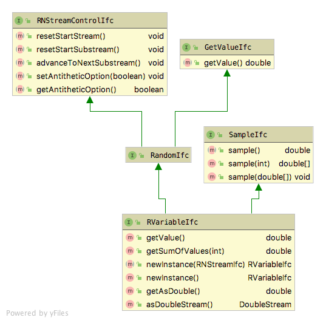

# Random Variate Generation and Probability Modeling

**[Learning Objectives]{.smallcaps}**

-   To be able to generate random variates using the Java Simulation
    Library (JSL)
-	  To understand how to use the JSL for basic probability computations

The JSL has the capability to generate random variates from both
discrete and continuous distributions. The [`jsl.utilities.random.rvariable`](https://rossetti.git-pages.uark.edu/JSL-Documentation/jsl/utilities/random/rvariable/package-summary.html) package supports this functionality. The package has a set of Java interfaces
that define the behavior associated with random variables. Concrete
sub-classes of specific random variables are created by sub-classing
`AbstractRVariable`. As shown in Figure \@ref(fig:RVariableIfc), every random variable has
access to an object that implements the `RNStreamIfc` interface. This
gives it the ability to generate pseudo-random numbers and to control
the streams. The `GetValueIfc` interface is the key interface because in
this context it returns a random value from the random variable. For
example, if `d` is a reference to an instance of a sub-class of type
`AbstractRVariable`, then `d.getValue()` generates a random value.

 

## Continuous and Discrete Random Variables

The names and parameters associated with the continuous random variables
are as follows:

-   BetaRV(double alpha1, double alpha2)
-   ChiSquaredRV(double degressOfFreedom)
-   ExponentialRV(double mean)
-   GammaRV(double shape, double scale)
-   GeneralizedBetaRV(double alpha1, double alpha2, double min, double max)
-   JohnsonBRV(double alpha1, double alpha2, double min, double max)
-   LaplaceRV(double mean, double scale)
-   LogLogisticRV(double shape, double scale)
-   LognormalRV(double mean, double variance)
-   NormalRV(double mean, double variance)
-   PearsonType5RV(double shape, double scale)
-   PearsonType6RV(double alpha1, double alpha2, double beta)
-   StudentTRV(double dof)
-   TriangularRV(double min, double mode, double max)
-   UniformRV(double lowerLimit, double upperLimit)
-   WeibullRV(double shape, double scale)

The names and parameters associated with the discrete random variables
are as follows:

-   BernoulliRV(double prob)
-   BinomialRV(double prob, int numTrials)
-   ConstantRV(double value), a degenerate probability mass on a single
    value that cannot be changed
-   DEmpiricalRV(double\[\] value, double\[\] cdf), the value array
    holds the values that can be returned, while the cdf array holds the
    cumulative probabilities associated with the values
-   DUniformRV(int minimum, int maximum)
-   GeometricRV(double prob), range is 0 to infinity
-   NegativeBinomialRV(double prob, double numSuccess), range is 0 to
    infinity. The number of failures befor the $r^{th}$ success.
-   PoissonRV(double mean)
-   ShiftedGeometricRV(double prob), range is 1 to infinity
-   VConstantRV(double value), a degenerate probability mass on a single
    value that can be changed

## Overview of Generation Algorithms

As you can see, the name of the distribution followed by the letters RV designate the class names.  Implementations of these classes extend the `AbstractRVarable` class, which implements the `RVariableIfc` interface.  Users simply create and instance of the class and then use it to get a sequence of values that have the named probability distribution. In order to implement a new random variable (i.e. some random variable
that is not already implemented) you can extend the class
`AbstractRVariable`. This provides a basic template for what is expected
in the implementation. However, it implies that you need to implement
all of the required interfaces. The key method to implement is the
protected `generate()` method, which should return the generated random
value.

In almost all cases, the JSL utilizes the inverse transform method for generating random variates. Thus, there is a one to one mapping of the underlying pseudo-random number and the resulting random variate. Even in the case of distributions that do not have closed form inverse cumulative distribution functions, the JSL utilizes numerical methods to approximate the function whenever feasible. For example, the JSL uses a rational function approximation, see Cody (1969), to
implement the inverse cumulative distribution function for the standard
normal distribution. The inversion for the gamma distribution is based
on Algorithm AS 91 for inverting the chi-squared distribution and
exploiting its relationship with the gamma. The beta distribution also
uses numerical methods to compute the cumulative distribution function
as well as bi-section search to determine the inverse for cumulative
distribution function.

The JSL implements the `BernoulliRV`, `DUniformRV`, `GeometricRV`,
`NegativeBinomialRV`, and `ShiftedGeometricRV` classes using the methods
described in Chapter 2 of @Rossetti2015. While more efficient methods may be available, the
`PoissonRV` and `BinomialRV` distributions are implemented by searching the
probability mass functions. Both search methods use an approximation to
get close to the value of the inverse and then search up or down through
the cumulative distribution function. Because of this both distributions
use numerically stable methods to compute the cumulative distribution
function values. The `DEmpiricalRV` class also searches through the
cumulative distribution function.

## Creating and Using Random Variables

The following example code illustrates how to create a normal random variable and how to generate values.

```java
// create a normal mean = 20.0, variance = 4.0 random variable
NormalRV n = new NormalRV(20.0, 4.0);
System.out.printf("%3s %15s %n", "n", "Values");
// generate some values
for (int i = 0; i < 5; i++) {
	// getValue() method returns generated values
	double x = n.getValue();
	System.out.printf("%3d %15f %n", i+1, x);
}
```
The resulting output is what you would expect.

```
  n          Values 
  1       21.216624 
  2       23.639128 
  3       25.335884 
  4       17.599163 
  5       23.858350 
```
Alternatively, the user can use the `sample()` method to generate an array of values that can be later processed. The following code illustrates how to do that with a triangular distribution.

```java
// create a triangular random variable with min = 2.0, mode = 5.0, max = 10.0
TriangularRV t = new TriangularRV(2.0, 5.0, 10.0);
// sample 5 values
double[] sample = t.sample(5);
System.out.printf("%3s %15s %n", "n", "Values");
for (int i = 0; i < sample.length; i++) {
	System.out.printf("%3d %15f %n", i+1, sample[i]);
}
```
Again, the output is what we would expect.

```
  n          Values 
  1        3.515540 
  2        6.327783 
  3        4.382075 
  4        7.392228 
  5        8.409238 
```
It is important to note that the full range of functionality related to stream control is also available for random variables.  That is, the underlying stream can be reset to its start, can be advanced to the next substream, can generate antithetic variates, etc.  Each new instance of a random variable is supplied with its own unique stream that is not shared with another other random variable instances.  Since this underlying random number generator has an enormous number of streams, approximately $1.8 \times 10^{19}$, it is very unlikely that the user will create so many streams as to start reusing them.  However, the streams that are used by random variable instances can be supplied directly so that they may be shared.  The following following code example illustrates how to assign a specific stream by passing a specific stream instance into the constructor of the random variable.

```java
// get stream 3
RNStreamIfc stream = JSLRandom.rnStream(3);
// create a normal mean = 20.0, variance = 4.0, with the stream
NormalRV n = new NormalRV(20.0, 4.0, stream);
System.out.printf("%3s %15s %n", "n", "Values");
for (int i = 0; i < 5; i++) {
	// getValue() method returns generated values
	double x = n.getValue();
	System.out.printf("%3d %15f %n", i+1, x);
}
```
As a final example, the discrete empirical distribution requires a little more setup. The user must supply the set of values that can be generated as well as an array holding the cumulative distribution probability across the values. The following code illustrates how to do this.

```java
// values is the set of possible values
double[] values = {1.0, 2.0, 3.0, 4.0};
// cdf is the cumulative distribution function over the values
double[] cdf = {1.0/6.0, 3.0/6.0, 5.0/6.0, 1.0};
//create a discrete empirical random variable
DEmpiricalRV n1 = new DEmpiricalRV(values, cdf);
System.out.println(n1);
System.out.printf("%3s %15s %n", "n", "Values");
for (int i = 1; i <= 5; i++) {
	System.out.printf("%3d %15f %n", i+1, n1.getValue());
}
```

While the preferred method for generating random values from random
variables is to create instance of the appropriate random variable
class, the JSL also provide a set of functions for generating random
values within the `JSLRandom` class. For all the previously listed random variables, there is a 
corresponding function that will generate a random value.  For
example, the method `rNormal()` will generate a normally distributed
value. Each method is named with an \"r\" in front of the distribution
name. By using static import of `JSLRandom` the user can more conveniently call these methods. The following code example illustrates how to do this.

```java
// use import static jsl.utilities.random.rvariable.JSLRandom.*;
// at the top of your java file
double v = rUniform(10.0, 15.0); // generate a U(10, 15) value
double x = rNormal(5.0, 2.0); // generate a Normal(mu=5.0, var= 2.0) value
double n = rPoisson(4.0); //generate from a Poisson(mu=4.0) value
System.out.printf("v = %f, x = %f, n = %f %n", v, x, n);
```

In addition to random values through these static methods, the
`JSLRandom` class provides a set of methods for randomly selecting from
arrays and lists and for creating permutations of arrays and lists. In
addition, there is a set of methods for sampling from arrays and lists
without replacement. The following code provide examples of using these methods.

```java
// create a list
List<String> strings = Arrays.asList("A", "B", "C", "D");
// randomly pick from the list, with equal probability
for (int i=1; i<=5; i++){
	System.out.println(randomlySelect(strings));
}

// create an array to hold a population of values
double[] y = new double[10];
for (int i = 0; i < 10; i++) {
	y[i] = i + 1;
}

// create the population
DPopulation p = new DPopulation(y);
System.out.println(p);

// permute the population
p.permute();
System.out.println(p);

// directly permute the array using JSLRandom
System.out.println("Permuting y");
JSLRandom.permutation(y);
System.out.println(DPopulation.toString(y));

// sample from the population
double[] x = p.sample(5);
System.out.println("Sampling 5 from the population");
System.out.println(DPopulation.toString(x));

// create a string list and permute it
List<String> strList = new ArrayList<>();
strList.add("a");
strList.add("b");
strList.add("c");
strList.add("d");
System.out.println(strList);
JSLRandom.permutation(strList);
System.out.println(strList);
```

## Modeling Probability Distributions

The `jsl.utilities.random.rvariable` package is the key package for generating random variables; however, it does not facilitate performing calculations involving the underlying probability distributions. To perform calculations involving probability distributions, you should use the `jsl.utilities.distribution` package.  This package has almost all the same distributions represented within the `jsl.utilities.random.rvariable` package.  

 

Figure\@ref(fig:DistPackage) illustrates the interfaces used to define probability distributions. First, the interface, `CDFIfc` serves as the basis for discrete distributions via the `DiscreteDistributionIfc` interface, for continuous distributions via the `ContinuousDistributionIfc` interface and the general `DistributionIfc` interface. The discrete distributions such as the geometric, binomial, etc. implement the `DiscreteDistributionIfc` and `PMFIfc` interfaces. Similarly, continuous distributions like the normal, uniform, etc. implement the `ContinuousDistributionIfc` and `PDFIfc` interfaces.  All concrete implementations of distributions extend from the abstract base class `Distribution`, which implements the `DistributionIfc` interface.  Thus, all distributions have the following capabilities:

* `cdf(double b)` - computes the cumulative probability, $F(b) = P(X \leq b)$
* `cdf(double a, double b)` - computes the cumulative probability, $P( a \leq X \leq b)$
* `complementaryCDF(double b)` - computes the cumulative probability, $1-F(b) = P(X > b)$
* `getMean()` - returns the expected value (mean) of the distribution
* `getVariance()` - returns the variance of the distribution
* `getStandardDeviation()` - returns the standard deviation of the distribution
* `invCDF(double p)` - returns the inverse of the cumulative distribution function $F^{-1}(p)$. This is performed by numerical search if necessary

Discrete distributions have a method called `pmf(double k)` that returns the probability associated with the value $k$.  Continuous distributions have a probability density function, $f(x)$, implemented in the method, `pdf(double x)`.  Finally, all distributions know how to create random variables through the `GetRVariableIfc` interface that provides the following methods.

* `RVariableIfc getRandomVariable(RNStreamIfc stream)` - returns a new instance of a random variable based on the current values of the distribution's parameters that uses the supplied stream
* `RVariableIfc getRandomVariable(int streamNum)` - returns a new instance of a random variable based on the current values of the distribution's parameters that uses the supplied stream number
* `RVariableIfc getRandomVariable()` - returns a new instance of a random variable based on the current values of the distribution's parameters that uses a newly created stream

As an example, the following code illustrates some calculations for the binomial distribution.

```java
// make and use a Binomial(p, n) distribution
int n = 10;
double p = 0.8;
System.out.println("n = " + n);
System.out.println("p = " + p);
Binomial bnDF = new Binomial(p, n);
System.out.println("mean = " + bnDF.getMean());
System.out.println("variance = " + bnDF.getVariance());
// compute some values
System.out.printf("%3s %15s %15s %n", "k", "p(k)", "cdf(k)");
for (int i = 0; i <= 10; i++) {
	System.out.printf("%3d %15.10f %15.10f %n", i, bnDF.pmf(i), bnDF.cdf(i));
}
```
The output shows the mean, variance, and basic probability calculations.

```
n = 10
p = 0.8
mean = 8.0
variance = 1.5999999999999996
  k            p(k)          cdf(k) 
  0    0.0000001024    0.0000001024 
  1    0.0000040960    0.0000041984 
  2    0.0000737280    0.0000779264 
  3    0.0007864320    0.0008643584 
  4    0.0055050240    0.0063693824 
  5    0.0264241152    0.0327934976 
  6    0.0880803840    0.1208738816 
  7    0.2013265920    0.3222004736 
  8    0.3019898880    0.6241903616 
  9    0.2684354560    0.8926258176 
 10    0.1073741824    1.0000000000 
```
The `jsl.utilities.random.rvariable` package creates instances of random variables that are immutable. That is, once you create a random variable, its parameters cannot be changed.  However, distributions permit their parameters to be changed and they also facilitate the creation of random variables.  The following code uses the `setParameters()` method to change the parameters of the previously created binomial distribution and then creates a random variable based on the mutated distribution.

```java
// change the probability and number of trials
bnDF.setParameters(0.5, 20);
System.out.println("mean = " + bnDF.getMean());
System.out.println("variance = " + bnDF.getVariance());
// make random variables based on the distributions
RVariableIfc brv = bnDF.getRandomVariable();
System.out.printf("%3s %15s %n", "n", "Values");
// generate some values
for (int i = 0; i < 5; i++) {
	// getValue() method returns generated values
	int x = (int)brv.getValue();
	System.out.printf("%3d %15d %n", i+1, x);
}
```
The results are as we would expect. Similar calculations can be made for continuous distributions. In most cases, the concrete implementations of the various distributions have specialize methods beyond those generic methods described here. Please refer to the java docs for further details.

```
mean = 10.0
variance = 5.0
  n          Values 
  1              11 
  2              14 
  3              16 
  4               7 
  5              14 
```
There are a number of useful static methods defined for the binomial, normal, gamma, and Student-T distributions. Specifically, for the binomial distribution, has the following static methods

* `binomialPMF(int j, int n, double p)` - directly computes the probability for the value $j$
* `binomialCDF(int j, int n, double p)` - directly computes the cumulative distribution function for the value $j$
* `binomialCCDF(int j, int n, double p)`- directly computes the complementary cumulative distribution function for the value of $j$
* `binomialInvCDF(double x, int n, double p)` - directly computes the inverse cumulative distribution function

These methods are designed to perform their calculations in a numerically stable manner to ensure numerical accuracy. The normal distribution has the following static methods for computations involving the standard normal distribution.

* `stdNormalCDF(double z)` - the cumulative probability for a $Z ~ N(0,1)$ random variable, i.e. $F(z) = P(Z \leq z)$
* `stdNormalComplementaryCDF(double z)` - returns $1-P(Z \leq z)$
* `stdNormalInvCDF(double p)` - returns $ z = F^{-1}(p)$ the inverse of the cumulative distribution function

The Student-T distribution also has two static convenience methods to facilitate computations.

* `getCDF(double dof, double x)` - computes the cumulative distribution function for $x$ given the degrees of freedom
* `getInvCDF(double dof, double p)` - computes the inverse cumulative distribution function or t-value for the supplied probability given the degrees of freedom.

Within the gamma distribution there are some convenience methods for computing the gamma function, the natural logarithm of the gamma function, the incomplete gamma function, and the digamma function (derivative of the natural logarithm of the gamma function).


