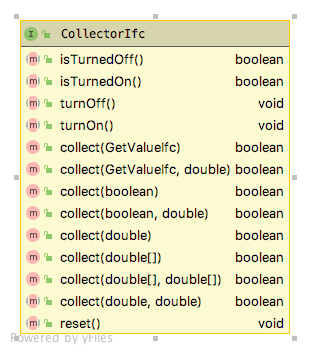
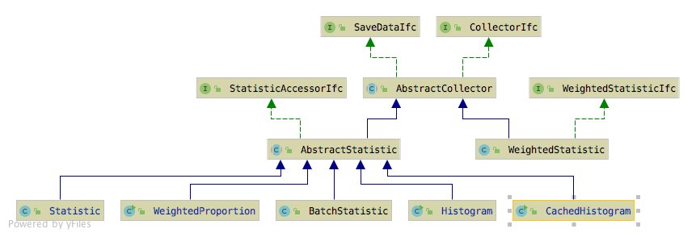
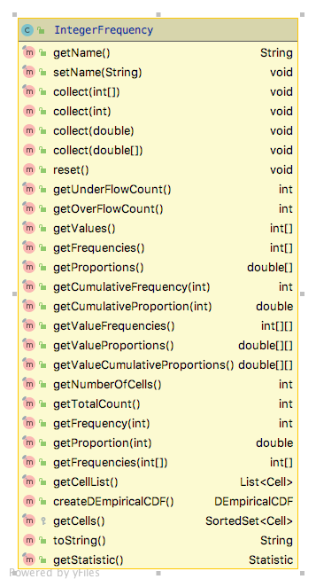

# Collecting Statistics {#statistics}

**[Learning Objectives]{.smallcaps}**

-   To be able to collect statistics using classes within the JSL
-	  To understand the basics of statistical computations supported by the JSL

The JSL has a wide variety of classes that support statistic computations.  A main theme in understanding the usage of the classes within the [`jsl.utilities.statistics`](https://rossetti.git-pages.uark.edu/JSL-Documentation/jsl/utilities/statistic/package-summary.html) package is the concept of collection.  This concept is encapsulated within the interface, `CollectorIfc` interface.  The methods of the `CollectorIfc` interface are illustrated in Figure \@ref(fig:CollectorIfc).

 

Something is a collector, if it implements the `CollectorIfc` interface. The implication is that those values presented to the various `collect` methods will be observed and tabulated into various quantities based on the presented values. The `collect` method has been overridden to facilitate collection of double values, arrays of double values, and boolean values. The two parameter `collect` methods permit collection of a second set of values.  The second parameter is meant to represent the weight associated with the first parameter.  As we will see, this facilitates the collection of weighted statistics.  Collection can be turned on or off and can be reset. Turning collection off should cause the presented values to be ignored during the off period.  Resetting a collector should set the state of the collector as if no values had been presented.  Thus, resetting a collector should clear all previous collection results.

Figure \@ref(fig:Statistics) presents the major classes and interfaces within the statistics package. The `CollectIfc` interface is implemented within the abstract base class `AbstractCollector`, which serves as the basis for various concrete implementations of statistical collectors. The `SaveDataIfc` interface defines methods for indicating whether or not the data collected should be saved into arrays. There are two major kinds of statistics one of which assumes that the values presented must be weighted, the `WeightedStatisticIfc` interface and the `WeightedStatistic` class. While the other branch of classes, derived from `AbstractStatistic` do not necessarily have to be weighted. The main classes to be discussed here are `Statistic` and `Histogram`.

 

## Creating and Using a Statistic

The `Statistic` class has a great deal of functionality.  It accumulates summary statistics on the values presented to it via its `collect` methods. Recall also that since the `Statistic` class implements the `CollectorIfc` interface, you can use the `reset()` method to clear all accumulated statistics and reuse the `Statistic` instance.  The major statistical quantities are found in the `StatisticAccessor` interface.

\begin{figure}

{\centering \includegraphics[width=0.6\linewidth,height=0.6\textheight]{./figures/StatisticAccessor} 

}

\caption{Major Accumulated Statistical Quantities}(\#fig:StatisticAccessor)
\end{figure}
As can be seen in Figure \@ref(fig:StatisticAccessor), the `Statistic` class not only computes the standard statistical quantities such as the count, average, and variance, it also has functionality to compute confidence intervals, skewness, kurtosis, the minimum, the maximum, and lag 1 covariance and correlation. The computed confidence intervals are based on the assumption that the observed data are normally distributed or that the sample size is large enough to justify using the central limit theorem to assume that the sampling distribution is normal. Thus, we can assume that the confidence intervals are approximate.  The summary statistics are computed via efficient one pass algorithms that do not require any observed data to be stored.  The algorithms are designed to minimize issues related to numerical precision within the calculated results.  The `toString()` method of the `Statistic` class has been overridden to contain all of the computed values.  Let's illustrate the usage of the `Statistic` class with some code. In this code, first we create a normal random variable to be able to generate some data. Then, two statistics are created. The first statistic directly collects the generated values. The second statistic is designed to collect $P(X\geq 20.0)$ by observing whether or not the generated value meets this criteria as defined by the boolean expression `x >= 20.0`.

```java
// create a normal mean = 20.0, variance = 4.0 random variable
NormalRV n = new NormalRV(20.0, 4.0);
// create a Statistic to observe the values
Statistic stat = new Statistic("Normal Stats");
Statistic pGT20 = new Statistic("P(X>=20");
// generate 100 values
for (int i = 1; i <= 100; i++) {
	// getValue() method returns generated values
	double x = n.getValue();
	stat.collect(x);
	pGT20.collect(x >= 20.0);
}
System.out.println(stat);
```
The results for the statistics collected directly on the observations from the `toString()` method are as follows. 

```
ID 1
Name Normal Stats
Number 100.0
Average 20.370190128861807
Standard Deviation 2.111292233346322
Standard Error 0.2111292233346322
Half-width 0.4189261806189412
Confidence Level 0.95
Confidence Interval [19.951263948242865, 20.78911630948075]
Minimum 15.020744984423821
Maximum 25.33588436770212
Sum 2037.0190128861807
Variance 4.457554894588499
Weighted Average 20.370190128861797
Weighted Sum 2037.0190128861796
Sum of Weights 100.0
Weighted Sum of Squares 41935.76252316213
Deviation Sum of Squares 441.2979345642614
Last value collected 21.110736402119805
Last weighted collected 1.0
Kurtosis -0.534855387072145
Skewness 0.20030433873223502
Lag 1 Covariance -0.973414579833684
Lag 1 Correlation -0.22057990840016864
Von Neumann Lag 1 Test Statistic -2.2136062395518343
Number of missing observations 0.0
Lead-Digit Rule(1) -1
```
Of course, this is probably more output than what you need, but you can use the methods illustrated in Figure \@ref(fig:StatisticAccessor) to access specific desired quantities. Notice that in the code example that the $P(X \geq 20.0)$ is also collected. This is done by using the boolean expression `x >= 20.0` within the `collect()` method. This expression evaluates to either true or false. The true values are presented as 1.0 and the false values as 0.0. Thus, this expression acts as an indicator variable and facilitates the estimation of probabilities. The results from the statistics can be pretty printed by using the `StatisticReporter` class, which takes a list of objects that implement the `StatisticAccessorIfc` interface and facilitates the writing and printing of various statistical summary reports.

```java
StatisticReporter reporter = new StatisticReporter(List.of(stat, pGT20));
System.out.println(reporter.getHalfWidthSummaryReport());
```

```
Half-Width Statistical Summary Report - Confidence Level (95.000)% 

Name                                     	        Count 	      Average 	   Half-Width 
---------------------------------------------------------------------------------------------------- 
Normal Stats                             	          100 	      20.3702 	       0.4189 
P(X>=20                                  	          100 	       0.5100 	       0.0997 
---------------------------------------------------------------------------------------------------- 
```

The `Statistic` class has a number of very useful static methods that work on arrays and compute various statistical quantities.

* `int getIndexOfMin(double[] x)` - returns the index of the element that is smallest. If there are ties, the first found is returned.
* `double getMin(double[] x)` - returns the element that is smallest. If there are ties, the first found is returned.
* `int getIndexOfMax(double[] x)` - returns the index of the element that is largest If there are ties, the first found is returned.
* `double getMax(double[] x)` - returns the element that is largest. If there are ties, the first found is returned.
* `double getMedian(double[] data)` - returns the value that has 50 percent of the data above and below it.
* `int countLessEqualTo(double[] data, double x)` - returns the count of the elements that are less than or equal to $x$
* `int countLessThan(double[] data, double x)`  - returns the count of the elements that are less than $x$
* `int countGreaterEqualTo(double[] data, double x)`  - returns the count of the elements that are greater than or equal to $x$
* `int countGreaterThan(double[] data, double x)` - returns the count of the elements that are greater than $x$
* `double[] getOrderStatistics(double[] data)` - returns a sorted copy of the supplied array ordered from smallest to largest
* long estimateSampleSize(double desiredHW, double stdDev, double level)` - returns the approximate sample size necessary to reach the desired half-width at the specified confidence level given the estimate of the sample standard deviation.
* `Statistic collectStatistics(double[] x, double[] w)` - returns an instance of `Statistic` that summarizes the array of values and the supplied weights.
* `collectStatistics(double[] x)` - returns an instance of `Statistic` that summarizes the array of values 

## Histograms and Frequencies

A histogram tabulates counts and frequencies of observed data over a set of contiguous intervals.  Let $b_{0}, b_{1}, \cdots, b_{k}$ be the breakpoints (end points) of the class intervals such that $\left(b_{0}, b_{1} \right], \left(b_{1}, b_{2} \right], \cdots, \left(b_{k-1}, b_{k} \right]$ form $k$ disjoint and adjacent intervals.  The intervals do not have to be of equal width.  Also, $b_{0}$ can be equal to $-\infty$ resulting in interval $\left(-\infty, b_{1} \right]$ and $b_{k}$ can be equal to $+\infty$ resulting in interval $\left(b_{k-1}, +\infty \right)$. Define $\Delta b_j = b_{j} - b_{j-1}$ and if all the intervals have the same width (except perhaps for the end intervals), $\Delta b = \Delta b_j$. To count the number of observations that fall in each interval, we can use the count function:
$$
c(\vec{x}\leq b) = \#\lbrace x_i \leq b \rbrace \; i=1,\ldots,n
$$
$c(\vec{x}\leq b)$ counts the number of observations less than or equal to $x$. Let $c_{j}$ be the observed count of the $x$ values contained in the $j^{th}$ interval $\left(b_{j-1}, b_{j} \right]$. Then, we can determine $c_{j}$ via the following equation:
$$
c_{j} = c(\vec{x}\leq b_{j}) - c(\vec{x}\leq b_{j-1})
$$ 
The key parameters of a histogram are: 

* The first bin lower limit ($b_{0}$):  This is the starting point of the range over which the data will be tabulated.
* The number of bins ($k$))
* The width of the bins, ($\Delta b$)

\begin{figure}

{\centering \includegraphics[width=0.6\linewidth,height=0.6\textheight]{./figures/Histogram} 

}

\caption{Histogram Class}(\#fig:Histogram)
\end{figure}
Figure \@ref(fig:Histogram) presents the methods of the `Histogram` class.  The `Histogram` class is utilized in a very similar manner as the `Statistic` class by collecting observations.  The observations are then tabulated into the bins. The `Histogram` class allows the user to tabulate the bin contents via the collect() methods inherited from the `AbstractStatistic` base class.  Since data may fall below the first bin and after the last bin, the implementation also provides counts for those occurrences.  Since a `Histogram` is a sub-class of `AbstractStatistic`, it also implements the `StatisticAccessorIfc` to provide summary statistics on the data tabulated within the bins.  The `Histogram` class also provides static methods to create histograms based on a range (lower limit to upper limit) with a given number of bins.  In this case, an appropriate bin width is computed.   

In some cases, the client may not know in advance the appropriate settings for the number of bins or the width of the bins.  In this situation, one can use the `CachedHistogram` class, which first collects the data in a temporary cache array. Once the cache has been filled up, the `CachedHistogram` computes a reasonable lower limit, number of bins, and bin width based on the statistics collected over the cache.  The underlying histogram is available via the getHistogram() method after the cache has been used.

```java
ExponentialRV d = new ExponentialRV(2);
// create a histogram with lower limit 0.0, 20 bins, of width 0.1
Histogram h = new Histogram(0.0, 20, 0.1);
for (int i = 1; i <= 100; ++i) {
	h.collect(d.getValue());
}
System.out.println(h);
```

```
Histogram: Histogram
-------------------------------------
Number of bins = 20
Bin width = 0.1
First bin starts at = 0.0
Last bin ends at = 2.0
Under flow count = 0.0
Over flow count = 45.0
Total bin count = 55.0
Total count = 100.0
-------------------------------------
Bin Range        Count Total Prob  CumProb
  1 [0.00,0.10)   2.0   2.0 0.036364 0.036364 
  2 [0.10,0.20)   5.0   7.0 0.090909 0.127273 
  3 [0.20,0.30)   5.0  12.0 0.090909 0.218182 
  4 [0.30,0.40)   2.0  14.0 0.036364 0.254545 
  5 [0.40,0.50)   7.0  21.0 0.127273 0.381818 
  6 [0.50,0.60)   3.0  24.0 0.054545 0.436364 
  7 [0.60,0.70)   3.0  27.0 0.054545 0.490909 
  8 [0.70,0.80)   3.0  30.0 0.054545 0.545455 
  9 [0.80,0.90)   2.0  32.0 0.036364 0.581818 
 10 [0.90,1.00)   2.0  34.0 0.036364 0.618182 
 11 [1.00,1.10)   5.0  39.0 0.090909 0.709091 
 12 [1.10,1.20)   6.0  45.0 0.109091 0.818182 
 13 [1.20,1.30)   2.0  47.0 0.036364 0.854545 
 14 [1.30,1.40)   2.0  49.0 0.036364 0.890909 
 15 [1.40,1.50)   3.0  52.0 0.054545 0.945455 
 16 [1.50,1.60)   1.0  53.0 0.018182 0.963636 
 17 [1.60,1.70)   1.0  54.0 0.018182 0.981818 
 18 [1.70,1.80)   1.0  55.0 0.018182 1.000000 
 19 [1.80,1.90)   0.0  55.0 0.000000 1.000000 
 20 [1.90,2.00)   0.0  55.0 0.000000 1.000000 
```
The JSL will also tabulate count frequencies when the values are only integers.  This is accomplished with the `IntegerFrequency` class. Figure \@ref(fig:Frequency) indicates the methods of the `IntegerFrequency` class. The object can return information on the counts and proportions.  It can even create a `DEmpiricalCDF` distribution based on the observed data.

 

In the following code example, an instance of the `IntegerFrequency` class is created. Then, an instance of a binomial random variable is used to generate a sample of 10,000 observations.  The sample is then collected by the `IntegerFrequency` class's `collect()` method. 

```java
IntegerFrequency f = new IntegerFrequency("Frequency Demo");
BinomialRV bn = new BinomialRV(0.5, 100);
double[] sample = bn.sample(10000);
f.collect(sample);
System.out.println(f);
```
As can be noted in the output, only those integers that are actually observed are tabulated in terms of the count of the number of times the integer is observed and its proportion. The user does not have to specify the range of possible integers; however, instances of `IntegerFrequency` can be created that specify a lower and upper limit on the tabulated values.  The overflow and underflow counts then tabulate when observations fall outside of the specified range.

```
Frequency Tabulation Frequency Demo
----------------------------------------
Number of cells = 39
Lower limit = -2147483648
Upper limit = 2147483647
Under flow count = 0
Over flow count = 0
Total count = 10000
----------------------------------------
Value 	 Count 	 Proportion
31 	 1 	 1.0E-4
33 	 4 	 4.0E-4
34 	 5 	 5.0E-4
35 	 9 	 9.0E-4
36 	 17 	 0.0017
37 	 28 	 0.0028
38 	 41 	 0.0041
39 	 74 	 0.0074
40 	 100 	 0.01
41 	 192 	 0.0192
42 	 236 	 0.0236
43 	 277 	 0.0277
44 	 406 	 0.0406
45 	 453 	 0.0453
46 	 564 	 0.0564
47 	 653 	 0.0653
48 	 741 	 0.0741
49 	 762 	 0.0762
50 	 750 	 0.075
51 	 768 	 0.0768
52 	 783 	 0.0783
53 	 679 	 0.0679
54 	 600 	 0.06
55 	 484 	 0.0484
56 	 407 	 0.0407
57 	 324 	 0.0324
58 	 210 	 0.021
59 	 155 	 0.0155
60 	 108 	 0.0108
61 	 74 	 0.0074
62 	 41 	 0.0041
63 	 15 	 0.0015
64 	 15 	 0.0015
65 	 17 	 0.0017
66 	 3 	 3.0E-4
67 	 1 	 1.0E-4
69 	 1 	 1.0E-4
70 	 1 	 1.0E-4
71 	 1 	 1.0E-4
----------------------------------------
```
Finally, the JSL provides the ability to define labeled states and to tabulate frequencies and proportions related to the visitation and transition between the states.  This functionality is available in the `StateFrequency` class. The following code example creates an instance of `StateFrequency` by providing the number of states. The states are returned in a `List` and then 10,000 states are randomly selected from the list with equal probability using the `JSLRandom` functionality to randomly select from lists. The randomly selected state is then observed via the `collect()` method.

```java
// number of states is 6
StateFrequency sf = new StateFrequency(6);
List<State> states = sf.getStates();
for(int i=1;i<=10000;i++){
    State state = JSLRandom.randomlySelect(states);
    sf.collect(state);
}
System.out.println(sf);
```
The output is what you would expect based on selecting the states with equal probability. Notice that the `StateFrequency` class not only tabulates the visits to the states, similar to `IntegerFrequency`, it also counts and tabulates the transitions between states. These detailed tabulations are available via the various methods of the class. See the Java docs for further details.

```
State Frequency Tabulation for: Identity#1
State Labels
State{id=1, number=0, name='State:0'}
State{id=2, number=1, name='State:1'}
State{id=3, number=2, name='State:2'}
State{id=4, number=3, name='State:3'}
State{id=5, number=4, name='State:4'}
State{id=6, number=5, name='State:5'}
State transition counts
[288, 272, 264, 282, 265, 286]
[283, 278, 283, 286, 296, 266]
[286, 298, 263, 264, 247, 282]
[271, 263, 275, 279, 280, 294]
[274, 305, 273, 281, 296, 268]
[254, 277, 282, 270, 313, 255]
State transition proportions
[0.17380808690404345, 0.16415208207604104, 0.15932407966203982, 0.17018708509354255, 0.15992757996378998, 0.17260108630054316]
[0.16725768321513002, 0.16430260047281323, 0.16725768321513002, 0.1690307328605201, 0.17494089834515367, 0.15721040189125296]
[0.174390243902439, 0.18170731707317073, 0.1603658536585366, 0.16097560975609757, 0.15060975609756097, 0.1719512195121951]
[0.16305655836341756, 0.1582430806257521, 0.1654632972322503, 0.16787003610108303, 0.1684717208182912, 0.17689530685920576]
[0.1614614024749558, 0.17972893341190335, 0.16087212728344136, 0.16558632881555688, 0.17442545668827342, 0.15792575132586917]
[0.15384615384615385, 0.16777710478497881, 0.17080557238037553, 0.16353725015142337, 0.18958207147183526, 0.15445184736523318]

Frequency Tabulation Identity#1
----------------------------------------
Number of cells = 6
Lower limit = 0
Upper limit = 5
Under flow count = 0
Over flow count = 0
Total count = 10000
----------------------------------------
Value 	 Count 	 Proportion
0 	 1657 	 0.1657
1 	 1693 	 0.1693
2 	 1640 	 0.164
3 	 1662 	 0.1662
4 	 1697 	 0.1697
5 	 1651 	 0.1651
----------------------------------------
```
## Batch Statistics
In simulation, we often collect data that is correlated, that is not independent.  This causes difficulty in developing valid confidence intervals for the estimators.  Grouping the data into batches and computing the average of each batch is one methodology for reducing the dependence within the data.  The idea is that the average associated with each batch will tend to be less dependent, especially the larger the batch size.  The method of batch means provides a mechanism for developing an estimator for $Var\lbrack \bar{X} \rbrack$.

The method of batch means is based on observations $(X_{1}, X_{2}, X_{3}, \dots, X_{n})$. The idea is to group the output into batches of size, $b$, such that the averages of the data within a batch are more nearly independent and possibly normally distributed.  

\begin{multline*}
\underbrace{X_1, X_2, \ldots, X_b}_{batch 1} \cdots 
\underbrace{X_{b+1}, X_{b+2}, \ldots, X_{2b}}_{batch 2} \cdots \\
\underbrace{X_{(j-1)b+1}, X_{(j-1)b+2}, \ldots, X_{jb}}_{batch j}  \cdots 
\underbrace{X_{(k-1)b+1}, X_{(k-1)b+2}, \ldots, X_{kb}}_{batch k}
\end{multline*}

Let $k$ be the number of batches each of size $b$, where, $b = \lfloor \frac{n}{k}\rfloor$.  Define the $j^{th}$ batch mean (average) as:

$$
\bar{X}_j(b) = \dfrac{1}{b} \sum_{i=1}^b X_{(j-1)b+i}
$$
Each of the batch means are treated like observations in the batch means series.  For example, if the batch means are re-labeled as $Y_j = \bar{X}_j(b)$, the batching process simply produces another series of data, ($Y_1, Y_2, Y_3, \ldots, Y_k$) which may be more like a random sample.  Why should they be more independent?  Typically, in auto-correlated processes the lag-k auto-correlations decay rapidly as $k$ increases.  Since, the batch means are formed from batches of size $b$, provided that $b$ is large enough the data within a batch is *conceptually* far from the data in other batches.  Thus, larger batch sizes are good for ensuring independence; however, as the batch size increases the number of batches decreases and thus variance of the estimator will increase.

To form a $(1 - \alpha)$\% confidence interval, we simply treat this new series like a random sample and compute approximate confidence intervals using the sample average and sample variance of the batch means series: 

$$
\bar{Y}(k) = \dfrac{1}{k} \sum_{j=1}^k Y_j
$$
The sample variance of the batch process is based on the $k$ batches:
$$
S_b^2 (k) = \dfrac{1}{k - 1} \sum_{j=1}^k (Y_j - \bar{Y}^2)
$$
Finally, if the batch process can be considered independent and identically distributed the $1-\alpha$ level confidence interval can be written as follows:
$$
\bar{Y}(k) \pm t_{\alpha/2, k-1} \dfrac{S_b (k)}{\sqrt{k}}
$$
The `BatchStatistic` class within the statistic package implements a basic batching process.  The `BatchStatistic` class works with data as it is presented to its collect method.  Since we do not know in advance how much data we have, the `BatchStatistic` class has rules about the minimum number of batches and the size of batches that can be formed.  Theory indicates that we do not need to have a large number of batches and that it is better to have a relatively small number of batches that are large in size.  

Three attributes of the BatchStatistic class that are important are:

*	`myMinNumBatches` – This represents the minimum number of batches required.  The default value for this attribute is determined by `BatchStatistic`. `MIN_NUM_BATCHES`, which is set to 20.
*	`myMinBatchSize` – This represents the minimum size for forming initial batches.  The default value for this attribute is determined by `BatchStatistic`. `MIN_NUM_OBS_PER_BATCH`, which is set to 16.
*	`myMaxNumBatchesMultiple` – This represents a multiple of  minimum number of batches which is used to determine the upper limit (maximum) number of batches.  For example, if `myMaxNumBatchesMultiple = 2` and the `myMinNumBatches = 20`, then the maximum number of batches we can have is 40 (2*20).  The default value for this attribute is determined by `BatchStatistic`. `MAX_BATCH_MULTIPLE`, which is set to 2.

The `BatchStatistic` class uses instances of the `Statistic` class to do its calculations.  The bulk of the processing is done in two methods, `collect()` and `collectBatch()`. The `collect()` method simply uses an instance of the `Statistic` class (`myStatistic`) to collect statistics.  When the amount of data collected (`myStatistic.getCount()`) equals the current batch size (`myCurrentBatchSize`) then the `collectBatch()` method is called to form a batch.  

```java
public final boolean collect(double value, double weight) {
// other code
myTotNumObs = myTotNumObs + 1.0;
myValue = value;
myWeight = weight;
myStatistic.collect(myValue, myWeight);
if (myStatistic.getCount() == myCurrentBatchSize) {
   b = collectBatch();
}
```

Referring to the collectBatch() method in the following code, the batches that are formed are recorded in an array called bm[].  After recording the batch average, the statistic is reset for collecting the next batch of data.  The number of batches is recorded and if this has reached the maximum number of batches (as determined by the batch multiple calculation), we rebatch the batches back down to the minimum number of batches by combining adjacent batches according to the batch multiple.

```java
private boolean collectBatch() {
	boolean b = true;
	// increment the current number of batches
	myNumBatches = myNumBatches + 1;
	// record the average of the batch
	bm[myNumBatches] = myStatistic.getWeightedAverage();
	// collect running statistics on the batches
	b = myBMStatistic.collect(bm[myNumBatches]);
	// reset the within batch statistic for next batch
	myStatistic.reset();
	// if the number of batches has reached the maximum then rebatch down to
	// min number of batches
	if (myNumBatches == myMaxNumBatches) {
		myNumRebatches++;
		myCurrentBatchSize = myCurrentBatchSize * myMaxNumBatchesMultiple;
		int j = 0; // within batch counter
		int k = 0; // batch counter
		myBMStatistic.reset(); // clear for collection across new batches
		// loop through all the batches
		for (int i = 1; i <= myNumBatches; i++) {
			myStatistic.collect(bm[i]); // collect across batches old batches
			j++;
			if (j == myMaxNumBatchesMultiple) { // have enough for a batch
				//collect new batch average
				b = myBMStatistic.collect(myStatistic.getAverage());
				k++; //count the batches
				bm[k] = myStatistic.getAverage(); // save the new batch average
				myStatistic.reset(); // reset for next batch
				j = 0;
			}
		}
		myNumBatches = k; // k should be minNumBatches
		myStatistic.reset(); //reset for use with new data
	}
	return b;
}
```
There are a variety of procedures that have been developed that will automatically batch the data as it is collected. The JSL has a batching algorithm based on the procedure implemented within the Arena simulatin language. When a sufficient amount of data has been collected batches are formed.  As more data is collected, additional batches are formed until $k=40$  batches are collected.  When 40 batches are formed, the algorithm collapses the number of batches back to 20, by averaging each pair of batches.  This has the net effect of doubling the batch size.  This process is repeated as more data is collected, thereby ensuring that the number of batches is between 20 and 39. In addition, the procedure also computes the lag-1 correlation so that independence of the batches can be tested.

The `BatchStatistic` class also provides a public `rebatchToNumberOfBatches()` method to allow the user to rebatch the batches to a user supplied number of batches.  Since the `BatchStatistic` class implements the `StatisticalAccessorIfc` interface, it can return the sample average, sample variance, minimum, maximum, etc. of the batches.  Within the discrete-event modeling constructs of the JSL, batching can be turned on to collect batch statistics during a replication.  The use of these constructs will be discussed when the discrete-event modeling elements of the JSL are presented.

The following code illustrates how to create and use a `BatchStatistic`.

```java
ExponentialRV d = new ExponentialRV(2);
// number of observations
int n = 1000; 
// minimum number of batches permitted
// there will not be less than this number of batches
int minNumBatches = 40;
// minimum batch size permitted
// the batch size can be no smaller than this amount
int minBatchSize = 25; 
// maximum number of batch multiple
//  The multiple of the minimum number of batches
//  that determines the maximum number of batches
//  e.g. if the min. number of batches is 20
//  and the max number batches multiple is 2,
//  then we can have at most 40 batches
int maxNBMultiple = 2; 
// In this example, since 40*25 = 1000, the batch multiple does not matter
BatchStatistic bm = new BatchStatistic(minNumBatches, minBatchSize, maxNBMultiple);
for (int i = 1; i <= n; ++i) {
	bm.collect(d.getValue());
}
System.out.println(bm);
double[] bma = bm.getBatchMeanArrayCopy();
int i=0;
for(double x: bma){
	System.out.println("bm(" + i + ") = " + x);
	i++;
}
// this rebatches the 40 down to 10
Statistic s = bm.rebatchToNumberOfBatches(10);
System.out.println(s);
```

## Summary

The `jsl.utilities.statistic` package defines a lot of functionality.  Here is a summary of some of the useful classes and interfaces.

1. `CollectorIfc` defines a set of collect() methods for collecting data. The method is overridden to permit the collection of a wide variety of data type. The collect() method is designed to collect values and a weight associated with the value. This allows the collection of weighted statistics. `AbstractCollector` is an abstract base class for building concrete sub-classes.
2. `SaveDataIfc` defines methods for saving the observed data to arrays.
3. `WeightedStatisticIfc` defines statistics that are computed on weighted data values.
`WeightedStatistic` is a concrete implementation of the interface.
4. `AbstractStatistic` is an abstract base class for defining statistics. Sub-classes of `AbstractStatistic` compute summary statistics of some kind.
5. `Histogram` defines a class to collect statistics and tabulate data into bins.
6. `Statistic` is a concrete implementation of `AbstractStatistic` allowing for a multitude of
summary statistics.
7. `BatchStatistic` is also a concrete implementation of `AbstractStatistic` that provides for
summarizing data via a batching process.
8. `IntegerFrequency` tabulates integer values into a frequencies by observed values, similar to a histogram.
9. `StateFrequency` facilitates defining labeled states and tabulating visitation and transition statistics.
10. `StatisticXY` collects statistics on $(x,y)$ pairs computing statistics on the $x$ and $y$ values separately, as well as the covariance and correlation between the observations within a pair.

The most important class within the statistics package is probably the
Statistic class. This class summarizes the observed data into summary
statistics such as: minimum, maximum, average, variance, standard
deviation, lag-1 correlation, and count. In addition, confidence
intervals can be formed on the observations based on the student-t
distribution. Finally, there are useful static methods for computing
statistics on arrays and for estimating sample sizes. The reader is
encourage to review the JSL documentation for all of the functionality,
including the ability to write nicely printed statistical results.
